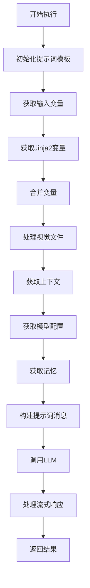

# Dify LLM节点技术分析文档

## 1. 概述

LLM节点是Dify工作流引擎中的核心组件之一，负责与大型语言模型进行交互，处理用户的提示词，生成AI响应。本文档深入分析LLM节点的实现架构、执行流程、配置管理和核心功能。

## 2. 架构设计

### 2.1 类层次结构

```python
BaseNode (抽象基类)
    ↓
LLMNode (实现类)
```

**核心类说明：**

- `BaseNode`: 所有工作流节点的基类，定义了节点的基本接口和生命周期
- `LLMNode`: LLM节点的具体实现，继承自BaseNode，实现了LLM特有的逻辑

### 2.2 主要组件

LLM节点主要由以下组件构成：

1. **节点核心类** (`LLMNode`)
2. **数据实体类** (`LLMNodeData`, `ModelConfig`, 等)
3. **工具类** (`llm_utils`)
4. **文件处理器** (`LLMFileSaver`, `FileSaverImpl`)
5. **异常处理** (`exc.py`)

## 3. 核心数据结构

### 3.1 LLMNodeData

```python
class LLMNodeData(BaseNodeData):
    model: ModelConfig                          # 模型配置
    prompt_template: Sequence[LLMNodeChatModelMessage] | LLMNodeCompletionModelPromptTemplate  # 提示词模板
    prompt_config: PromptConfig                 # 提示词配置
    memory: Optional[MemoryConfig]              # 记忆配置
    context: ContextConfig                      # 上下文配置
    vision: VisionConfig                        # 视觉能力配置
    structured_output: Mapping[str, Any]        # 结构化输出
    structured_output_switch_on: bool           # 结构化输出开关
```

### 3.2 ModelConfig

```python
class ModelConfig(BaseModel):
    provider: str                    # 模型提供商 (如 openai, anthropic)
    name: str                       # 模型名称 (如 gpt-4, claude-3)
    mode: LLMMode                   # 模型模式 (chat/completion)
    completion_params: dict[str, Any] # 完成参数 (温度、最大令牌等)
```

### 3.3 配置类型

- **ContextConfig**: 上下文变量配置
- **VisionConfig**: 多模态视觉能力配置
- **PromptConfig**: Jinja2模板变量配置
- **MemoryConfig**: 对话记忆配置

## 4. 执行流程分析

### 4.1 整体执行流程



### 4.2 核心方法详解

#### 4.2.1 `_run()` 方法

这是LLM节点的主要执行入口：

```python
def _run(self) -> Generator[NodeEvent | InNodeEvent, None, None]:
    # 1. 初始化变量
    node_inputs = None
    process_data = None
    result_text = ""
    usage = LLMUsage.empty_usage()
    
    try:
        # 2. 转换聊天消息模板
        self._node_data.prompt_template = self._transform_chat_messages(...)
        
        # 3. 获取输入变量
        inputs = self._fetch_inputs(node_data=self._node_data)
        jinja_inputs = self._fetch_jinja_inputs(node_data=self._node_data)
        inputs.update(jinja_inputs)
        
        # 4. 处理文件和上下文
        files = llm_utils.fetch_files(...) if vision_enabled else []
        context = self._fetch_context(node_data=self._node_data)
        
        # 5. 获取模型配置
        model_instance, model_config = LLMNode._fetch_model_config(...)
        
        # 6. 获取记忆
        memory = llm_utils.fetch_memory(...)
        
        # 7. 构建提示词
        prompt_messages, stop = LLMNode.fetch_prompt_messages(...)
        
        # 8. 调用LLM
        generator = LLMNode.invoke_llm(...)
        
        # 9. 处理响应流
        for event in generator:
            if isinstance(event, RunStreamChunkEvent):
                yield event
            elif isinstance(event, ModelInvokeCompletedEvent):
                result_text = event.text
                usage = event.usage
                break
                
    except Exception as e:
        # 错误处理
        yield RunCompletedEvent(run_result=NodeRunResult(status=FAILED, error=str(e)))
```

#### 4.2.2 `invoke_llm()` 静态方法

负责实际的LLM调用：

```python
@staticmethod
def invoke_llm(*,
    node_data_model: ModelConfig,
    model_instance: ModelInstance,
    prompt_messages: Sequence[PromptMessage],
    structured_output_enabled: bool,
    **kwargs
) -> Generator[NodeEvent | LLMStructuredOutput, None, None]:
    
    # 1. 获取模型架构
    model_schema = model_instance.model_type_instance.get_model_schema(...)
    
    # 2. 处理结构化输出
    if structured_output_enabled:
        output_schema = LLMNode.fetch_structured_output_schema(...)
        invoke_result = invoke_llm_with_structured_output(...)
    else:
        invoke_result = model_instance.invoke_llm(...)
    
    # 3. 处理调用结果
    return LLMNode.handle_invoke_result(invoke_result=invoke_result, ...)
```

#### 4.2.3 `handle_invoke_result()` 静态方法

处理LLM响应结果：

```python
@staticmethod
def handle_invoke_result(*,
    invoke_result: LLMResult | Generator[LLMResultChunk, None, None],
    file_saver: LLMFileSaver,
    file_outputs: list["File"],
    node_id: str,
) -> Generator[NodeEvent | LLMStructuredOutput, None, None]:
    
    # 处理阻塞模式
    if isinstance(invoke_result, LLMResult):
        yield handle_blocking_result(...)
        return
    
    # 处理流式模式
    usage = LLMUsage.empty_usage()
    full_text_buffer = io.StringIO()
    
    for result in invoke_result:
        if isinstance(result, LLMResultChunk):
            contents = result.delta.message.content
            
            # 处理多模态输出
            for text_part in _save_multimodal_output_and_convert_result_to_markdown(...):
                full_text_buffer.write(text_part)
                yield RunStreamChunkEvent(chunk_content=text_part, ...)
                
            # 更新元数据
            if result.delta.usage:
                usage = result.delta.usage
```

## 5. 变量处理机制

### 5.1 变量获取流程

LLM节点支持多种类型的变量：

1. **基础变量**: 从提示词模板中提取的变量
2. **Jinja2变量**: 支持复杂模板语法的变量
3. **系统变量**: 如查询、对话ID等
4. **上下文变量**: 来自知识检索等节点的上下文
5. **文件变量**: 多模态文件输入

### 5.2 变量解析

```python
def _fetch_inputs(self, node_data: LLMNodeData) -> dict[str, Any]:
    """获取基础输入变量"""
    inputs = {}
    prompt_template = node_data.prompt_template
    
    # 提取变量选择器
    variable_selectors = []
    if isinstance(prompt_template, list):
        for prompt in prompt_template:
            parser = VariableTemplateParser(template=prompt.text)
            variable_selectors.extend(parser.extract_variable_selectors())
    
    # 从变量池获取值
    for variable_selector in variable_selectors:
        variable = self.graph_runtime_state.variable_pool.get(variable_selector.value_selector)
        if variable is None:
            raise VariableNotFoundError(f"Variable {variable_selector.variable} not found")
        inputs[variable_selector.variable] = variable.to_object()
    
    return inputs
```

### 5.3 Jinja2变量处理

```python
def _fetch_jinja_inputs(self, node_data: LLMNodeData) -> dict[str, str]:
    """获取Jinja2模板变量"""
    variables = {}
    
    for variable_selector in node_data.prompt_config.jinja2_variables or []:
        variable = self.graph_runtime_state.variable_pool.get(variable_selector.value_selector)
        
        # 处理不同类型的变量
        if isinstance(variable, ArraySegment):
            # 数组类型处理
            result = ""
            for item in variable.value:
                if isinstance(item, dict):
                    result += parse_dict(item) + "\n"
                else:
                    result += str(item) + "\n"
            value = result.strip()
        elif isinstance(variable, ObjectSegment):
            # 对象类型处理
            value = parse_dict(variable.value)
        else:
            # 基础类型处理
            value = variable.text
        
        variables[variable_selector.variable] = value
    
    return variables
```

## 6. 提示词管理

### 6.1 提示词类型

LLM节点支持两种提示词模式：

1. **聊天模式** (Chat Mode): 使用消息列表，支持多角色对话
2. **完成模式** (Completion Mode): 使用单一文本提示词

### 6.2 消息构建

```python
@staticmethod
def fetch_prompt_messages(*,
    sys_query: str | None = None,
    context: str | None = None,
    memory: TokenBufferMemory | None = None,
    model_config: ModelConfigWithCredentialsEntity,
    prompt_template: Sequence[LLMNodeChatModelMessage] | LLMNodeCompletionModelPromptTemplate,
    **kwargs
) -> tuple[Sequence[PromptMessage], Optional[Sequence[str]]]:
    
    prompt_messages = []
    
    if isinstance(prompt_template, list):
        # 聊天模式：处理消息列表
        prompt_messages.extend(handle_list_messages(...))
        
        # 添加记忆消息
        memory_messages = _handle_memory_chat_mode(...)
        prompt_messages.extend(memory_messages)
        
        # 添加当前查询
        if sys_query:
            message = LLMNodeChatModelMessage(text=sys_query, role=PromptMessageRole.USER)
            prompt_messages.extend(handle_list_messages([message], ...))
            
    elif isinstance(prompt_template, LLMNodeCompletionModelPromptTemplate):
        # 完成模式：处理单一模板
        prompt_messages.extend(_handle_completion_template(...))
        
        # 处理记忆文本
        memory_text = _handle_memory_completion_mode(...)
        # 将记忆插入提示词
        prompt_content = prompt_messages[0].content
        if "#histories#" in prompt_content:
            prompt_content = prompt_content.replace("#histories#", memory_text)
        else:
            prompt_content = memory_text + "\n" + prompt_content
    
    return prompt_messages, model_config.stop
```

### 6.3 多模态支持

LLM节点支持处理图像、视频、音频等多媒体内容：

```python
def handle_list_messages(*,
    messages: Sequence[LLMNodeChatModelMessage],
    vision_detail_config: ImagePromptMessageContent.DETAIL,
    **kwargs
) -> Sequence[PromptMessage]:
    
    for message in messages:
        # 获取段组
        segment_group = variable_pool.convert_template(message.text)
        
        # 处理文件段
        file_contents = []
        for segment in segment_group.value:
            if isinstance(segment, FileSegment):
                file = segment.value
                if file.type in {FileType.IMAGE, FileType.VIDEO, FileType.AUDIO}:
                    file_content = file_manager.to_prompt_message_content(
                        file, image_detail_config=vision_detail_config
                    )
                    file_contents.append(file_content)
        
        # 创建包含文件的消息
        if file_contents:
            prompt_message = _combine_message_content_with_role(
                contents=file_contents, role=message.role
            )
            prompt_messages.append(prompt_message)
```

## 7. 记忆管理

### 7.1 记忆机制

LLM节点集成了对话记忆功能，支持：

- **TokenBufferMemory**: 基于令牌限制的缓冲记忆
- **窗口记忆**: 限制对话轮数的记忆
- **角色前缀**: 为完成模式设置用户和助手前缀

### 7.2 记忆获取

```python
def fetch_memory(
    variable_pool: VariablePool,
    app_id: str,
    node_data_memory: Optional[MemoryConfig],
    model_instance: ModelInstance
) -> Optional[TokenBufferMemory]:
    
    if not node_data_memory:
        return None
    
    # 获取对话ID
    conversation_id_variable = variable_pool.get(["sys", SystemVariableKey.CONVERSATION_ID.value])
    if not isinstance(conversation_id_variable, StringSegment):
        return None
    
    # 从数据库获取对话
    with Session(db.engine) as session:
        conversation = session.scalar(
            select(Conversation).where(
                Conversation.app_id == app_id,
                Conversation.id == conversation_id_variable.value
            )
        )
    
    if conversation:
        return TokenBufferMemory(conversation=conversation, model_instance=model_instance)
    
    return None
```

### 7.3 记忆处理

```python
def _handle_memory_chat_mode(*,
    memory: TokenBufferMemory | None,
    memory_config: MemoryConfig | None,
    model_config: ModelConfigWithCredentialsEntity,
) -> Sequence[PromptMessage]:
    
    if memory and memory_config:
        # 计算剩余令牌
        rest_tokens = _calculate_rest_token(prompt_messages=[], model_config=model_config)
        
        # 获取历史消息
        memory_messages = memory.get_history_prompt_messages(
            max_token_limit=rest_tokens,
            message_limit=memory_config.window.size if memory_config.window.enabled else None,
        )
        return memory_messages
    
    return []
```

## 8. 流式处理

### 8.1 事件系统

LLM节点使用事件驱动的架构来处理流式响应：

- **RunStreamChunkEvent**: 流式文本块事件
- **ModelInvokeCompletedEvent**: 模型调用完成事件
- **RunCompletedEvent**: 节点运行完成事件
- **RunRetrieverResourceEvent**: 检索资源事件

### 8.2 流式响应处理

```python
def handle_invoke_result(*,
    invoke_result: Generator[LLMResultChunk, None, None],
    **kwargs
) -> Generator[NodeEvent, None, None]:
    
    full_text_buffer = io.StringIO()
    usage = LLMUsage.empty_usage()
    
    for result in invoke_result:
        if isinstance(result, LLMResultChunk):
            contents = result.delta.message.content
            
            # 处理多模态输出并转换为Markdown
            for text_part in _save_multimodal_output_and_convert_result_to_markdown(
                contents=contents,
                file_saver=file_saver,
                file_outputs=file_outputs,
            ):
                full_text_buffer.write(text_part)
                # 发送流式事件
                yield RunStreamChunkEvent(
                    chunk_content=text_part,
                    from_variable_selector=[node_id, "text"]
                )
            
            # 更新元数据
            if result.delta.usage:
                usage = result.delta.usage
    
    # 发送完成事件
    yield ModelInvokeCompletedEvent(
        text=full_text_buffer.getvalue(),
        usage=usage,
        finish_reason=finish_reason
    )
```

## 9. 结构化输出

### 9.1 结构化输出支持

LLM节点支持结构化输出，允许LLM按照预定义的JSON Schema返回结构化数据：

```python
@staticmethod
def fetch_structured_output_schema(*,
    structured_output: Mapping[str, Any],
) -> dict[str, Any]:
    """获取结构化输出架构"""
    
    if not structured_output:
        raise LLMNodeError("Please provide a valid structured output schema")
    
    schema_str = json.dumps(structured_output.get("schema", {}), ensure_ascii=False)
    if not schema_str:
        raise LLMNodeError("Please provide a valid structured output schema")
    
    try:
        schema = json.loads(schema_str)
        if not isinstance(schema, dict):
            raise LLMNodeError("structured_output_schema must be a JSON object")
        return schema
    except json.JSONDecodeError:
        raise LLMNodeError("structured_output_schema is not valid JSON format")
```

### 9.2 结构化输出调用

```python
if structured_output_enabled:
    output_schema = LLMNode.fetch_structured_output_schema(
        structured_output=structured_output or {},
    )
    invoke_result = invoke_llm_with_structured_output(
        provider=model_instance.provider,
        model_schema=model_schema,
        model_instance=model_instance,
        prompt_messages=prompt_messages,
        json_schema=output_schema,
        model_parameters=node_data_model.completion_params,
        stop=list(stop or []),
        stream=True,
        user=user_id,
    )
```

## 10. 多模态处理

### 10.1 文件处理

LLM节点具备处理多种文件类型的能力：

```python
@staticmethod
def _save_multimodal_output_and_convert_result_to_markdown(*,
    contents: str | list[PromptMessageContentUnionTypes] | None,
    file_saver: LLMFileSaver,
    file_outputs: list["File"],
) -> Generator[str, None, None]:
    """转换中间提示消息为字符串并保存多媒体内容"""
    
    if isinstance(contents, str):
        yield contents
    elif isinstance(contents, list):
        for item in contents:
            if isinstance(item, TextPromptMessageContent):
                yield item.data
            elif isinstance(item, ImagePromptMessageContent):
                # 保存图像文件
                file = LLMNode.save_multimodal_image_output(
                    content=item,
                    file_saver=file_saver,
                )
                file_outputs.append(file)
                # 转换为Markdown格式
                yield LLMNode._image_file_to_markdown(file)
```

### 10.2 文件保存器

```python
class LLMFileSaver(Protocol):
    """LLM文件保存器协议"""
    
    def save_binary_string(self,
        data: bytes,
        mime_type: str,
        file_type: FileType,
        extension_override: str | None = None,
    ) -> File:
        """保存二进制数据为文件"""
        pass
    
    def save_remote_url(self, url: str, file_type: FileType) -> File:
        """从远程URL保存文件"""
        pass

class FileSaverImpl(LLMFileSaver):
    """文件保存器实现"""
    
    def save_binary_string(self, data: bytes, mime_type: str, file_type: FileType, **kwargs) -> File:
        tool_file_manager = self._get_tool_file_manager()
        tool_file = tool_file_manager.create_file_by_raw(
            user_id=self._user_id,
            tenant_id=self._tenant_id,
            file_binary=data,
            mimetype=mime_type,
        )
        
        extension = _get_extension(mime_type, kwargs.get('extension_override'))
        url = sign_tool_file(tool_file.id, extension)
        
        return File(
            tenant_id=self._tenant_id,
            type=file_type,
            transfer_method=FileTransferMethod.TOOL_FILE,
            filename=tool_file.name,
            extension=extension,
            mime_type=mime_type,
            size=len(data),
            related_id=tool_file.id,
            url=url,
            storage_key=tool_file.file_key,
        )
```

## 11. 错误处理与重试

### 11.1 异常类型

LLM节点定义了多种特定的异常类型：

```python
class LLMNodeError(ValueError):
    """LLM节点错误基类"""

class VariableNotFoundError(LLMNodeError):
    """变量未找到错误"""

class InvalidContextStructureError(LLMNodeError):
    """无效上下文结构错误"""

class ModelNotExistError(LLMNodeError):
    """模型不存在错误"""

class NoPromptFoundError(LLMNodeError):
    """未找到提示词错误"""

class MemoryRolePrefixRequiredError(LLMNodeError):
    """记忆角色前缀必需错误"""
```

### 11.2 错误策略

LLM节点支持多种错误处理策略：

```python
class ErrorStrategy(StrEnum):
    FAIL_BRANCH = "fail-branch"      # 失败分支
    DEFAULT_VALUE = "default-value"  # 默认值

def _get_error_strategy(self) -> Optional[ErrorStrategy]:
    return self._node_data.error_strategy

@property
def continue_on_error(self) -> bool:
    return self._node_data.error_strategy is not None
```

### 11.3 重试机制

```python
def _get_retry_config(self) -> RetryConfig:
    return self._node_data.retry_config

@property
def retry(self) -> bool:
    return self._node_data.retry_config.retry_enabled
```

## 12. 配额管理

### 12.1 配额扣除

LLM节点在调用完成后会自动扣除配额：

```python
def deduct_llm_quota(tenant_id: str, model_instance: ModelInstance, usage: LLMUsage) -> None:
    """扣除LLM配额"""
    
    provider_configuration = model_instance.provider_model_bundle.configuration
    
    # 仅处理系统提供商配额
    if provider_configuration.using_provider_type != ProviderType.SYSTEM:
        return
    
    system_configuration = provider_configuration.system_configuration
    quota_unit = None
    
    # 确定配额单位
    for quota_configuration in system_configuration.quota_configurations:
        if quota_configuration.quota_type == system_configuration.current_quota_type:
            quota_unit = quota_configuration.quota_unit
            break
    
    # 计算使用的配额
    used_quota = None
    if quota_unit:
        if quota_unit == QuotaUnit.TOKENS:
            used_quota = usage.total_tokens
        elif quota_unit == QuotaUnit.CREDITS:
            used_quota = dify_config.get_model_credits(model_instance.model)
        else:
            used_quota = 1
    
    # 更新数据库中的配额使用情况
    if used_quota is not None:
        with Session(db.engine) as session:
            stmt = update(Provider).where(...).values(
                quota_used=Provider.quota_used + used_quota,
                last_used=naive_utc_now(),
            )
            session.execute(stmt)
            session.commit()
```

## 13. 性能优化

### 13.1 令牌计算优化

```python
def _calculate_rest_token(*,
    prompt_messages: list[PromptMessage],
    model_config: ModelConfigWithCredentialsEntity
) -> int:
    """计算剩余令牌数"""
    
    rest_tokens = 2000  # 默认值
    
    model_context_tokens = model_config.model_schema.model_properties.get(ModelPropertyKey.CONTEXT_SIZE)
    if model_context_tokens:
        model_instance = ModelInstance(
            provider_model_bundle=model_config.provider_model_bundle,
            model=model_config.model
        )
        
        # 计算当前消息的令牌数
        curr_message_tokens = model_instance.get_llm_num_tokens(prompt_messages)
        
        # 获取max_tokens参数
        max_tokens = 0
        for parameter_rule in model_config.model_schema.parameter_rules:
            if parameter_rule.name == "max_tokens":
                max_tokens = model_config.parameters.get(parameter_rule.name, 0)
        
        # 计算剩余令牌
        rest_tokens = model_context_tokens - max_tokens - curr_message_tokens
        rest_tokens = max(rest_tokens, 0)
    
    return rest_tokens
```

### 13.2 流式处理优化

LLM节点通过以下方式优化流式处理性能：

1. **即时yield**: 收到数据立即产出，避免缓冲
2. **增量处理**: 逐块处理文本，减少内存占用
3. **异步文件保存**: 多媒体文件异步保存到存储

## 14. 集成与扩展

### 14.1 节点注册

LLM节点通过节点映射系统注册到工作流引擎：

```python
# api/core/workflow/nodes/node_mapping.py
NODE_TYPE_CLASSES_MAPPING: Mapping[NodeType, Mapping[str, type[BaseNode]]] = {
    NodeType.LLM: {
        LATEST_VERSION: LLMNode,
        "1": LLMNode,
    },
    # ... 其他节点类型
}
```

### 14.2 版本管理

LLM节点支持版本化，当前版本为"1"：

```python
@classmethod
def version(cls) -> str:
    return "1"
```

### 14.3 默认配置

```python
@classmethod
def get_default_config(cls, filters: Optional[dict] = None) -> dict:
    return {
        "type": "llm",
        "config": {
            "prompt_templates": {
                "chat_model": {
                    "prompts": [
                        {"role": "system", "text": "You are a helpful AI assistant.", "edition_type": "basic"}
                    ]
                },
                "completion_model": {
                    "conversation_histories_role": {"user_prefix": "Human", "assistant_prefix": "Assistant"},
                    "prompt": {
                        "text": "Here are the chat histories...",
                        "edition_type": "basic",
                    },
                    "stop": ["Human:"],
                },
            }
        },
    }
```

## 15. 最佳实践

### 15.1 配置建议

1. **模型选择**: 根据任务复杂度选择合适的模型
2. **温度设置**: 创意任务使用较高温度(0.7-1.0)，精确任务使用较低温度(0.0-0.3)
3. **令牌限制**: 合理设置max_tokens避免截断
4. **记忆配置**: 长对话启用记忆，设置合适的窗口大小

### 15.2 性能优化

1. **变量缓存**: 复用变量避免重复计算
2. **流式输出**: 长文本生成启用流式输出
3. **上下文管理**: 合理控制上下文长度
4. **错误重试**: 配置合适的重试策略

### 15.3 安全考虑

1. **输入验证**: 验证用户输入避免注入攻击
2. **输出过滤**: 过滤敏感内容
3. **配额控制**: 设置合理的使用限制
4. **访问控制**: 实施适当的权限控制

## 16. 总结

LLM节点是Dify工作流引擎的核心组件，具有以下特点：

1. **架构清晰**: 采用面向对象设计，职责分离明确
2. **功能完整**: 支持多种模型、多模态、记忆、结构化输出等丰富功能
3. **性能优化**: 流式处理、令牌计算、配额管理等优化机制
4. **扩展性强**: 支持版本化、插件化扩展
5. **错误处理**: 完善的异常处理和重试机制

通过深入理解LLM节点的实现原理，开发者可以更好地使用和扩展Dify的AI工作流能力，构建更强大的AI应用。

---

*文档版本: 1.0*  
*生成时间: 2024年*  
*适用于: Dify开源版本*
