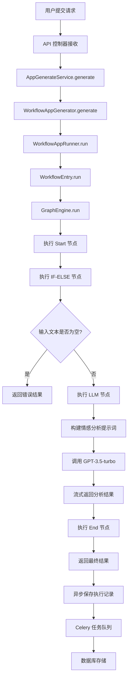

# Dify 情感分析 Workflow 源码分析文档

## 概述

本文档深入分析 Dify 项目中情感分析 Workflow 的完整实现机制，从前端 Web 模块的构建到 API 后端的调度执行，展现了一个现代化的工作流编排系统的核心架构。

## 1. 系统架构概览

Dify 的 Workflow 系统采用了分层架构设计：

```
┌─────────────────────────────────────────────────────────────┐
│                    Web Frontend                             │
│  ┌─────────────────┐ ┌─────────────────┐ ┌─────────────────┐│
│  │   Workflow UI   │ │  Node Editor    │ │   State Store   ││
│  │   (React Flow)  │ │   (各种节点)    │ │    (Zustand)    ││
│  └─────────────────┘ └─────────────────┘ └─────────────────┘│
└─────────────────────────────────────────────────────────────┘
                                │
                                │ HTTP API
                                ▼
┌─────────────────────────────────────────────────────────────┐
│                    API Backend                              │
│  ┌─────────────────┐ ┌─────────────────┐ ┌─────────────────┐│
│  │   Controllers   │ │   App Service   │ │   Graph Engine  ││
│  │   (REST API)    │ │   (应用生成)    │ │   (工作流执行)   ││
│  └─────────────────┘ └─────────────────┘ └─────────────────┘│
│  ┌─────────────────┐ ┌─────────────────┐ ┌─────────────────┐│
│  │   Workflow      │ │     Nodes       │ │    Storage      ││
│  │   (Entry/Runner)│ │   (节点实现)    │ │   (数据持久化)   ││
│  └─────────────────┘ └─────────────────┘ └─────────────────┘│
└─────────────────────────────────────────────────────────────┘
```

## 2. 前端 Workflow 构建机制

### 2.1 核心技术栈

前端 Workflow 基于以下技术构建：
- **React Flow**: 提供可视化的节点编辑器
- **Zustand**: 状态管理，支持复杂的工作流状态
- **TypeScript**: 类型安全的开发体验

### 2.2 状态管理架构

```typescript
// web/app/components/workflow/store/workflow/index.ts
export type Shape = 
  ChatVariableSliceShape 
  & EnvVariableSliceShape 
  & FormSliceShape 
  & WorkflowSliceShape 
  & NodeSliceShape 
  & ...

export const createWorkflowStore = (params: CreateWorkflowStoreParams) => {
  return createStore<Shape>((...args) => ({
    ...createWorkflowSlice(...args),
    ...createNodeSlice(...args),
    ...createFormSlice(...args),
    // 各种切片的组合
  }))
}
```

Workflow 状态通过多个切片(slices)组成：
- **WorkflowSlice**: 工作流基础状态
- **NodeSlice**: 节点管理状态  
- **FormSlice**: 表单编辑状态
- **VariableSlice**: 变量管理状态

### 2.3 可视化编辑器

```typescript
// web/app/components/workflow/index.tsx
const Workflow: FC = () => {
  return (
    <ReactFlowProvider>
      <ReactFlow
        nodes={nodes}
        edges={edges}
        nodeTypes={nodeTypes}
        edgeTypes={edgeTypes}
      >
        <Background />
        <CustomNode />
        <CustomEdge />
        <Operator />
      </ReactFlow>
    </ReactFlowProvider>
  )
}
```

## 3. 情感分析 Workflow 配置

从推荐应用配置中可以看到情感分析 Workflow 的定义：

```json
{
  "f06bf86b-d50c-4895-a942-35112dbe4189": {
    "app": {
      "icon": "🤖",
      "icon_background": "#FFEAD5", 
      "id": "f06bf86b-d50c-4895-a942-35112dbe4189",
      "mode": "workflow",
      "name": "Sentiment Analysis"
    },
    "description": "Batch sentiment analysis of text, followed by JSON output of sentiment classification along with scores.",
    "workflow": {
      "graph": {
        "nodes": [
          // Start 节点
          {
            "id": "start",
            "type": "start",
            "data": {
              "type": "start",
              "variables": [
                {
                  "variable": "input_text",
                  "type": "text-input",
                  "label": "Input Text",
                  "required": true
                }
              ]
            }
          },
          // IF-ELSE 条件判断节点
          {
            "id": "if-else-node", 
            "type": "if-else",
            "data": {
              "type": "if-else",
              "conditions": [
                {
                  "variable_selector": ["start", "input_text"],
                  "comparison_operator": "is not empty"
                }
              ]
            }
          },
          // LLM 情感分析节点
          {
            "id": "llm-sentiment",
            "type": "llm", 
            "data": {
              "type": "llm",
              "model": {
                "provider": "openai",
                "name": "gpt-3.5-turbo",
                "mode": "chat"
              },
              "prompt_template": [
                {
                  "role": "system",
                  "text": "Analyze the sentiment of the given text..."
                },
                {
                  "role": "user", 
                  "text": "{{#start.input_text#}}"
                }
              ]
            }
          },
          // End 节点
          {
            "id": "end",
            "type": "end",
            "data": {
              "type": "end",
              "outputs": {
                "sentiment_result": "{{#llm-sentiment.text#}}"
              }
            }
          }
        ],
        "edges": [
          {
            "source": "start",
            "target": "if-else-node"
          },
          {
            "source": "if-else-node", 
            "target": "llm-sentiment",
            "sourceHandle": "true"
          },
          {
            "source": "llm-sentiment",
            "target": "end"
          }
        ]
      }
    }
  }
}
```

## 4. API 后端调度机制

### 4.1 请求入口与路由

API 请求通过以下控制器入口：

```python
# api/controllers/service_api/app/workflow.py
@service_api_ns.route("/workflows/run")
class WorkflowRunApi(Resource):
    @validate_app_token
    def post(self, app_model: App, end_user: EndUser):
        """执行工作流"""
        app_mode = AppMode.value_of(app_model.mode)
        if app_mode != AppMode.WORKFLOW:
            raise NotWorkflowAppError()
            
        args = workflow_run_parser.parse_args()
        streaming = args.get("response_mode") == "streaming"
        
        response = AppGenerateService.generate(
            app_model=app_model,
            user=end_user, 
            args=args,
            invoke_from=InvokeFrom.SERVICE_API,
            streaming=streaming
        )
        
        return helper.compact_generate_response(response)
```

### 4.2 应用生成服务

```python
# api/services/app_generate_service.py
class AppGenerateService:
    @classmethod 
    def generate(cls, app_model: App, user: Union[Account, EndUser], 
                args: Mapping[str, Any], invoke_from: InvokeFrom, 
                streaming: bool = True):
        
        # 速率限制检查
        rate_limit = RateLimit(app_model.id, max_active_request)
        
        if app_model.mode == AppMode.WORKFLOW.value:
            workflow_id = args.get("workflow_id")
            workflow = cls._get_workflow(app_model, invoke_from, workflow_id)
            
            return rate_limit.generate(
                WorkflowAppGenerator.convert_to_event_stream(
                    WorkflowAppGenerator().generate(
                        app_model=app_model,
                        workflow=workflow,
                        user=user,
                        args=args,
                        invoke_from=invoke_from,
                        streaming=streaming
                    )
                ),
                request_id
            )
```

### 4.3 Workflow 应用生成器

```python  
# api/core/app/apps/workflow/app_generator.py
class WorkflowAppGenerator(BaseAppGenerator):
    def generate(self, app_model: App, workflow: Workflow, 
                user: Union[Account, EndUser], args: dict, 
                invoke_from: InvokeFrom, streaming: bool = True,
                call_depth: int = 0, 
                workflow_thread_pool_id: Optional[str] = None):
        
        # 创建应用配置
        app_config = WorkflowAppConfig(
            tenant_id=app_model.tenant_id,
            app_id=app_model.id,
            workflow_id=workflow.id,
            workflow=workflow
        )
        
        # 构建应用生成实体
        application_generate_entity = WorkflowAppGenerateEntity(
            task_id=str(uuid.uuid4()),
            app_config=app_config,
            inputs=inputs,
            user_id=user.id,
            stream=streaming,
            invoke_from=invoke_from,
            call_depth=call_depth
        )
        
        # 创建队列管理器
        queue_manager = AppQueueManager(
            task_id=application_generate_entity.task_id,
            user_id=application_generate_entity.user_id,
            invoke_from=application_generate_entity.invoke_from,
            conversation_id=None,
            app_mode=AppMode.WORKFLOW,
            message_id=None
        )
        
        # 启动 Workflow 应用运行器
        runner = WorkflowAppRunner(
            application_generate_entity=application_generate_entity,
            queue_manager=queue_manager, 
            variable_loader=variable_loader,
            workflow_thread_pool_id=workflow_thread_pool_id,
            workflow=workflow,
            system_user_id=system_user_id
        )
        
        # 异步运行
        runner_thread = threading.Thread(target=runner.run)
        runner_thread.start()
        
        return self._handle_response(queue_manager, streaming)
```

### 4.4 Workflow 运行器

```python
# api/core/app/apps/workflow/app_runner.py  
class WorkflowAppRunner(WorkflowBasedAppRunner):
    def run(self) -> None:
        """运行应用"""
        app_config = self.application_generate_entity.app_config
        
        # 创建变量池
        system_inputs = SystemVariable(
            files=files,
            user_id=self._sys_user_id,
            app_id=app_config.app_id,
            workflow_id=app_config.workflow_id,
            workflow_execution_id=self.application_generate_entity.workflow_execution_id
        )
        
        variable_pool = VariablePool(
            system_variables=system_inputs,
            user_inputs=inputs,
            environment_variables=self._workflow.environment_variables,
            conversation_variables=[]
        )
        
        # 初始化图
        graph = self._init_graph(graph_config=self._workflow.graph_dict)
        
        # 创建 Workflow 入口
        workflow_entry = WorkflowEntry(
            tenant_id=self._workflow.tenant_id,
            app_id=self._workflow.app_id,
            workflow_id=self._workflow.id,
            workflow_type=WorkflowType.value_of(self._workflow.type),
            graph=graph,
            graph_config=self._workflow.graph_dict,
            user_id=self.application_generate_entity.user_id,
            user_from=user_from,
            invoke_from=self.application_generate_entity.invoke_from,
            call_depth=self.application_generate_entity.call_depth,
            variable_pool=variable_pool,
            thread_pool_id=self.workflow_thread_pool_id
        )
        
        # 运行工作流
        generator = workflow_entry.run(callbacks=workflow_callbacks)
        
        for event in generator:
            self._handle_event(workflow_entry, event)
```

### 4.5 Workflow 入口

```python
# api/core/workflow/workflow_entry.py
class WorkflowEntry:
    def __init__(self, tenant_id: str, app_id: str, workflow_id: str,
                workflow_type: WorkflowType, graph_config: Mapping[str, Any],
                graph: Graph, user_id: str, user_from: UserFrom,
                invoke_from: InvokeFrom, call_depth: int, 
                variable_pool: VariablePool, 
                thread_pool_id: Optional[str] = None):
        
        # 初始化图运行时状态
        graph_runtime_state = GraphRuntimeState(
            variable_pool=variable_pool, 
            start_at=time.perf_counter()
        )
        
        # 创建图引擎
        self.graph_engine = GraphEngine(
            tenant_id=tenant_id,
            app_id=app_id,
            workflow_type=workflow_type,
            workflow_id=workflow_id,
            user_id=user_id,
            user_from=user_from,
            invoke_from=invoke_from,
            call_depth=call_depth,
            graph=graph,
            graph_config=graph_config,
            graph_runtime_state=graph_runtime_state,
            max_execution_steps=dify_config.WORKFLOW_MAX_EXECUTION_STEPS,
            max_execution_time=dify_config.WORKFLOW_MAX_EXECUTION_TIME,
            thread_pool_id=thread_pool_id
        )
    
    def run(self, *, callbacks: Sequence[WorkflowCallback]) -> Generator[GraphEngineEvent, None, None]:
        """运行工作流"""
        graph_engine = self.graph_engine
        
        try:
            generator = graph_engine.run()
            for event in generator:
                if callbacks:
                    for callback in callbacks:
                        callback.on_event(event=event)
                yield event
        except GenerateTaskStoppedError:
            pass
        except Exception as e:
            logger.exception("Unknown Error when workflow entry running")
            if callbacks:
                for callback in callbacks:
                    callback.on_event(event=GraphRunFailedEvent(error=str(e)))
```

## 5. 图引擎执行机制

### 5.1 图引擎核心类

```python
# api/core/workflow/graph_engine/graph_engine.py
class GraphEngine:
    def __init__(self, tenant_id: str, app_id: str, 
                workflow_type: WorkflowType, workflow_id: str,
                user_id: str, user_from: UserFrom, 
                invoke_from: InvokeFrom, call_depth: int,
                graph: Graph, graph_config: Mapping[str, Any],
                graph_runtime_state: GraphRuntimeState,
                max_execution_steps: int, max_execution_time: int,
                thread_pool_id: Optional[str] = None):
        
        self.graph = graph
        self.graph_config = graph_config  
        self.graph_runtime_state = graph_runtime_state
        self.max_execution_steps = max_execution_steps
        self.max_execution_time = max_execution_time
        # ... 其他初始化
    
    def run(self) -> Generator[GraphEngineEvent, None, None]:
        """运行图引擎"""
        start_node_id = self.graph.root_node_id
        
        yield GraphRunStartedEvent(
            graph_run_id=self.graph_runtime_state.workflow_run_id
        )
        
        try:
            generator = self._run(start_node_id=start_node_id)
            for event in generator:
                yield event
                
            yield GraphRunSucceededEvent(
                graph_run_id=self.graph_runtime_state.workflow_run_id
            )
        except Exception as e:
            yield GraphRunFailedEvent(
                graph_run_id=self.graph_runtime_state.workflow_run_id,
                error=str(e)
            )
    
    def _run(self, start_node_id: str) -> Generator[GraphEngineEvent, None, None]:
        """内部运行逻辑"""
        next_node_id = start_node_id
        
        while True:
            # 检查最大步数和执行时间限制
            if self.graph_runtime_state.node_run_steps > self.max_execution_steps:
                raise GraphRunFailedError(f"Max steps {self.max_execution_steps} reached.")
            
            if self._is_timed_out(self.graph_runtime_state.start_at, self.max_execution_time):
                raise GraphRunFailedError(f"Max execution time {self.max_execution_time}s reached.")
            
            # 获取节点配置
            node_config = self.graph.node_id_config_mapping.get(next_node_id)
            if not node_config:
                raise GraphRunFailedError(f"Node {next_node_id} config not found.")
            
            # 根据节点类型创建节点实例
            node_type = NodeType(node_config.get("data", {}).get("type"))
            node_version = node_config.get("data", {}).get("version", "1")
            node_cls = NODE_TYPE_CLASSES_MAPPING[node_type][node_version]
            
            # 创建节点实例
            node = node_cls(
                id=str(uuid.uuid4()),
                config=node_config,
                graph_init_params=graph_init_params,
                graph=self.graph,
                graph_runtime_state=self.graph_runtime_state
            )
            
            # 执行节点
            yield from self._execute_node(node)
            
            # 获取下一个节点
            next_node_id = self._get_next_node_id(node)
            if not next_node_id:
                break  # 到达终点
```

### 5.2 节点执行流程

图引擎按照以下流程执行每个节点：

1. **节点实例化**: 根据节点类型和版本创建对应的节点实例
2. **变量注入**: 将变量池中的变量注入到节点中
3. **节点执行**: 调用节点的 `run()` 方法
4. **结果处理**: 处理节点执行结果并更新变量池
5. **路径确定**: 根据执行结果确定下一个要执行的节点

## 6. 核心节点类型实现

### 6.1 节点类型枚举

```python
# api/core/workflow/nodes/enums.py
class NodeType(StrEnum):
    START = "start"                    # 开始节点
    END = "end"                       # 结束节点  
    LLM = "llm"                       # LLM 节点
    IF_ELSE = "if-else"               # 条件判断节点
    CODE = "code"                     # 代码执行节点
    HTTP_REQUEST = "http-request"     # HTTP 请求节点
    TOOL = "tool"                     # 工具调用节点
    TEMPLATE_TRANSFORM = "template-transform"  # 模板转换节点
    # ... 其他节点类型
```

### 6.2 LLM 节点实现

LLM 节点是情感分析 Workflow 的核心节点：

```python
# api/core/workflow/nodes/llm/node.py
class LLMNode(BaseNode):
    _node_type = NodeType.LLM
    _node_data: LLMNodeData
    
    def _run(self) -> Generator[NodeEvent | InNodeEvent, None, None]:
        """运行 LLM 节点"""
        
        # 1. 获取输入变量
        variable_pool = self.graph_runtime_state.variable_pool
        inputs = self._fetch_inputs(variable_pool)
        
        # 2. 构建提示词
        prompt_messages = self._organize_prompt_messages(inputs)
        
        # 3. 获取模型实例
        model_instance = self._fetch_model_instance()
        
        # 4. 调用 LLM
        yield NodeRunStartedEvent()
        
        try:
            if self._node_data.model.mode == LLMMode.CHAT:
                generator = model_instance.invoke_llm(
                    prompt_messages=prompt_messages,
                    model_parameters=model_parameters,
                    tools=tools,
                    stop=stop,
                    stream=True,
                    user=self.user_id
                )
            else:
                # completion mode
                generator = model_instance.invoke_llm(
                    prompt_messages=prompt_messages,
                    model_parameters=model_parameters,
                    stop=stop,
                    stream=True,
                    user=self.user_id
                )
            
            # 5. 处理流式响应
            full_text = ""
            usage = LLMUsage.empty_usage()
            
            for chunk in generator:
                if isinstance(chunk, LLMResultChunk):
                    if chunk.delta.message.content:
                        full_text += chunk.delta.message.content
                        yield RunStreamChunkEvent(
                            chunk_content=chunk.delta.message.content,
                            from_variable_selector=[self.node_id, "text"]
                        )
                    usage += chunk.delta.usage
            
            # 6. 返回结果
            yield NodeRunSucceededEvent(
                outputs={
                    "text": full_text,
                    "usage": usage.model_dump()
                }
            )
            
        except Exception as e:
            yield NodeRunFailedEvent(error=str(e))
    
    def _organize_prompt_messages(self, inputs: dict) -> list[PromptMessage]:
        """组织提示词消息"""
        prompt_template = self._node_data.prompt_template
        
        messages = []
        for message_config in prompt_template:
            role = message_config.get("role")
            text = message_config.get("text", "")
            
            # 使用变量模板解析器处理变量替换
            parsed_text = VariableTemplateParser.render(
                template=text,
                variable_pool=self.graph_runtime_state.variable_pool
            )
            
            if role == "system":
                messages.append(SystemPromptMessage(content=parsed_text))
            elif role == "user":
                messages.append(UserPromptMessage(content=parsed_text))
            elif role == "assistant":
                messages.append(AssistantPromptMessage(content=parsed_text))
        
        return messages
```

### 6.3 IF-ELSE 条件节点

```python
# api/core/workflow/nodes/if_else/if_else_node.py
class IfElseNode(BaseNode):
    _node_type = NodeType.IF_ELSE
    
    def _run(self) -> Generator[NodeEvent | InNodeEvent, None, None]:
        """运行条件判断节点"""
        
        yield NodeRunStartedEvent()
        
        variable_pool = self.graph_runtime_state.variable_pool
        conditions = self._node_data.conditions
        
        # 评估条件
        for condition in conditions:
            if self._evaluate_condition(condition, variable_pool):
                # 条件为真，走 true 分支
                yield NodeRunSucceededEvent(
                    outputs={"result": True},
                    edge_source_handle="true"
                )
                return
        
        # 所有条件都为假，走 false 分支  
        yield NodeRunSucceededEvent(
            outputs={"result": False},
            edge_source_handle="false"
        )
    
    def _evaluate_condition(self, condition: dict, variable_pool: VariablePool) -> bool:
        """评估单个条件"""
        variable_selector = condition["variable_selector"]
        comparison_operator = condition["comparison_operator"]
        value = condition.get("value", "")
        
        # 从变量池获取变量值
        variable_value = variable_pool.get(variable_selector)
        
        # 根据比较操作符进行判断
        if comparison_operator == "is not empty":
            return variable_value is not None and str(variable_value).strip() != ""
        elif comparison_operator == "is empty":
            return variable_value is None or str(variable_value).strip() == ""
        elif comparison_operator == "equals":
            return str(variable_value) == str(value)
        # ... 其他比较操作符
        
        return False
```

## 7. 异步执行与存储机制

### 7.1 Celery 异步任务

Dify 使用 Celery 进行异步任务处理，特别是工作流执行结果的存储：

```python
# api/tasks/workflow_execution_tasks.py
@shared_task(queue="workflow_storage", bind=True, max_retries=3, default_retry_delay=60)
def save_workflow_execution_task(
    self, execution_data: dict, tenant_id: str, app_id: str,
    triggered_from: str, creator_user_id: str, creator_user_role: str
) -> bool:
    """异步保存工作流执行结果"""
    
    try:
        session_factory = sessionmaker(bind=db.engine, expire_on_commit=False)
        
        with session_factory() as session:
            # 反序列化执行数据
            execution = WorkflowExecution.model_validate(execution_data)
            
            # 检查是否已存在
            existing_run = session.scalar(
                select(WorkflowRun).where(WorkflowRun.id == execution.id_)
            )
            
            if existing_run:
                # 更新现有记录
                _update_workflow_run_from_execution(existing_run, execution)
            else:
                # 创建新记录
                workflow_run = _create_workflow_run_from_execution(
                    execution=execution,
                    tenant_id=tenant_id,
                    app_id=app_id,
                    triggered_from=WorkflowRunTriggeredFrom(triggered_from),
                    creator_user_id=creator_user_id,
                    creator_user_role=CreatorUserRole(creator_user_role)
                )
                session.add(workflow_run)
            
            session.commit()
            return True
            
    except Exception as e:
        logger.exception("Failed to save workflow execution")
        # 重试机制
        raise self.retry(exc=e, countdown=60 * (2**self.request.retries))
```

### 7.2 Celery 存储库

```python
# api/core/repositories/celery_workflow_execution_repository.py  
class CeleryWorkflowExecutionRepository(WorkflowExecutionRepository):
    """使用 Celery 的异步工作流执行存储库"""
    
    def save(self, execution: WorkflowExecution) -> None:
        """异步保存工作流执行"""
        try:
            # 序列化执行数据
            execution_data = execution.model_dump()
            
            # 队列异步保存任务
            save_workflow_execution_task.delay(
                execution_data=execution_data,
                tenant_id=self._tenant_id,
                app_id=self._app_id or "",
                triggered_from=self._triggered_from.value if self._triggered_from else "",
                creator_user_id=self._creator_user_id,
                creator_user_role=self._creator_user_role.value
            )
            
            logger.debug("Queued async save for workflow execution: %s", execution.id_)
            
        except Exception as e:
            logger.exception("Failed to queue save operation for execution %s", execution.id_)
            raise
```

## 8. 情感分析 Workflow 执行流程

基于以上分析，情感分析 Workflow 的完整执行流程如下：



### 8.1 具体执行示例

当用户输入 "今天天气不错，下了中雨，很潮湿" 时：

1. **Start 节点**: 接收输入变量 `input_text`
2. **IF-ELSE 节点**: 检查 `input_text` 是否为空 → 条件为 false，继续执行
3. **LLM 节点**: 
   - 构建提示词：分析给定文本的情感...
   - 调用 GPT-3.5-turbo
   - 返回 JSON 格式的情感分析结果
4. **End 节点**: 输出最终的情感分析结果

### 8.2 变量传递机制

变量在节点间通过 `VariablePool` 传递：

```python
# 变量池结构
{
  "start": {
    "input_text": "今天天气不错，下了中雨，很潮湿"
  },
  "if-else-node": {
    "result": false
  },
  "llm-sentiment": {
    "text": "{\"positive_keywords\": [], \"negative_keywords\": [\"中雨\", \"潮湿\"], \"score\": -0.2, \"sentiment\": \"Negative\", \"categories\": [\"weather\"]}",
    "usage": {
      "prompt_tokens": 156,
      "completion_tokens": 45,
      "total_tokens": 201
    }
  }
}
```

## 9. 性能优化机制

### 9.1 线程池管理

```python
class GraphEngineThreadPool(ThreadPoolExecutor):
    def __init__(self, max_workers=None, max_submit_count=1000):
        super().__init__(max_workers)
        self.max_submit_count = max_submit_count
        self.submit_count = 0
    
    def submit(self, fn, /, *args, **kwargs):
        self.submit_count += 1
        self.check_is_full()
        return super().submit(fn, *args, **kwargs)
    
    def check_is_full(self) -> None:
        if self.submit_count > self.max_submit_count:
            raise ValueError(f"Max submit count {self.max_submit_count} reached.")
```

### 9.2 速率限制

```python
# 应用级别速率限制
max_active_request = AppGenerateService._get_max_active_requests(app_model)
rate_limit = RateLimit(app_model.id, max_active_request)

# 系统级别速率限制  
if dify_config.BILLING_ENABLED:
    if cls.system_rate_limiter.is_rate_limited(app_model.tenant_id):
        raise InvokeRateLimitError("Rate limit exceeded")
```

### 9.3 执行限制

```python
# 最大执行步数限制
if self.graph_runtime_state.node_run_steps > self.max_execution_steps:
    raise GraphRunFailedError(f"Max steps {self.max_execution_steps} reached.")

# 最大执行时间限制
if self._is_timed_out(start_at, max_execution_time):
    raise GraphRunFailedError(f"Max execution time {max_execution_time}s reached.")
```

## 10. 错误处理与重试机制

### 10.1 节点级错误处理

```python
class BaseNode:
    def run(self) -> Generator[NodeEvent | InNodeEvent, None, None]:
        try:
            # 节点执行逻辑
            yield from self._run()
        except Exception as e:
            if self._node_data.error_strategy == ErrorStrategy.FAIL_BRANCH:
                # 走错误分支
                yield NodeRunFailedEvent(
                    error=str(e),
                    edge_source_handle="error"
                )
            else:
                # 使用默认值
                yield NodeRunSucceededEvent(
                    outputs=self._node_data.default_value
                )
```

### 10.2 工作流级错误处理

```python
def run(self, *, callbacks: Sequence[WorkflowCallback]) -> Generator[GraphEngineEvent, None, None]:
    try:
        generator = graph_engine.run()
        for event in generator:
            yield event
    except GenerateTaskStoppedError:
        pass  # 正常停止
    except Exception as e:
        logger.exception("Unknown Error when workflow entry running")
        for callback in callbacks:
            callback.on_event(event=GraphRunFailedEvent(error=str(e)))
```

### 10.3 Celery 重试机制

```python
@shared_task(bind=True, max_retries=3, default_retry_delay=60)
def save_workflow_execution_task(self, execution_data, ...):
    try:
        # 保存逻辑
        pass
    except Exception as e:
        # 指数退避重试
        raise self.retry(exc=e, countdown=60 * (2**self.request.retries))
```

## 11. 监控与可观测性

### 11.1 事件流监控

工作流执行过程中会产生大量事件，用于监控和调试：

```python
# 图级事件
- GraphRunStartedEvent: 工作流开始
- GraphRunSucceededEvent: 工作流成功
- GraphRunFailedEvent: 工作流失败

# 节点级事件  
- NodeRunStartedEvent: 节点开始执行
- NodeRunSucceededEvent: 节点执行成功
- NodeRunFailedEvent: 节点执行失败
- NodeRunStreamChunkEvent: 流式数据块
```

### 11.2 日志记录

```python
class WorkflowLoggingCallback(WorkflowCallback):
    def on_event(self, event: GraphEngineEvent) -> None:
        if isinstance(event, NodeRunStartedEvent):
            logger.info(f"Node {event.node_id} started")
        elif isinstance(event, NodeRunSucceededEvent):
            logger.info(f"Node {event.node_id} succeeded")
        elif isinstance(event, NodeRunFailedEvent):
            logger.error(f"Node {event.node_id} failed: {event.error}")
```

## 12. 扩展性设计

### 12.1 节点扩展机制

添加新节点类型的步骤：

1. **定义节点类型**:
```python
class NodeType(StrEnum):
    SENTIMENT_ANALYSIS = "sentiment-analysis"  # 新增
```

2. **实现节点类**:
```python
class SentimentAnalysisNode(BaseNode):
    _node_type = NodeType.SENTIMENT_ANALYSIS
    
    def _run(self) -> Generator[NodeEvent | InNodeEvent, None, None]:
        # 实现具体逻辑
        pass
```

3. **注册节点映射**:
```python
NODE_TYPE_CLASSES_MAPPING[NodeType.SENTIMENT_ANALYSIS] = {
    "1": SentimentAnalysisNode
}
```

### 12.2 存储扩展

支持多种存储后端：

```python
# 同步存储
class DatabaseWorkflowExecutionRepository(WorkflowExecutionRepository):
    pass

# 异步存储  
class CeleryWorkflowExecutionRepository(WorkflowExecutionRepository):
    pass

# 可扩展其他存储方式
class RedisWorkflowExecutionRepository(WorkflowExecutionRepository):
    pass
```

## 13. 总结

Dify 的情感分析 Workflow 展现了一个完整的现代化工作流编排系统：

### 13.1 核心优势

1. **可视化编辑**: 基于 React Flow 的直观节点编辑器
2. **类型安全**: TypeScript + Python 类型注解确保代码质量
3. **高性能**: 异步执行 + 线程池 + 速率限制
4. **容错性**: 多层级错误处理和重试机制  
5. **可扩展**: 插件式节点架构，易于扩展新功能
6. **可观测**: 完整的事件流和日志监控

### 13.2 架构特点

- **分层架构**: 前端展示层、API 服务层、核心执行层分离
- **事件驱动**: 基于事件的异步编程模型
- **插件化**: 节点即插件，支持灵活扩展
- **状态管理**: 集中式变量池管理执行状态

### 13.3 技术栈

**前端**: React + TypeScript + Zustand + React Flow  
**后端**: Python + Flask + SQLAlchemy + Celery  
**存储**: PostgreSQL + Redis  
**监控**: 自定义事件系统 + 结构化日志

这个架构为构建复杂的 AI 工作流提供了坚实的基础，支持从简单的情感分析到复杂的多步骤 AI 处理流程。

---

**作者**: AI 源码分析助手  
**日期**: 2024年12月  
**版本**: 1.0
